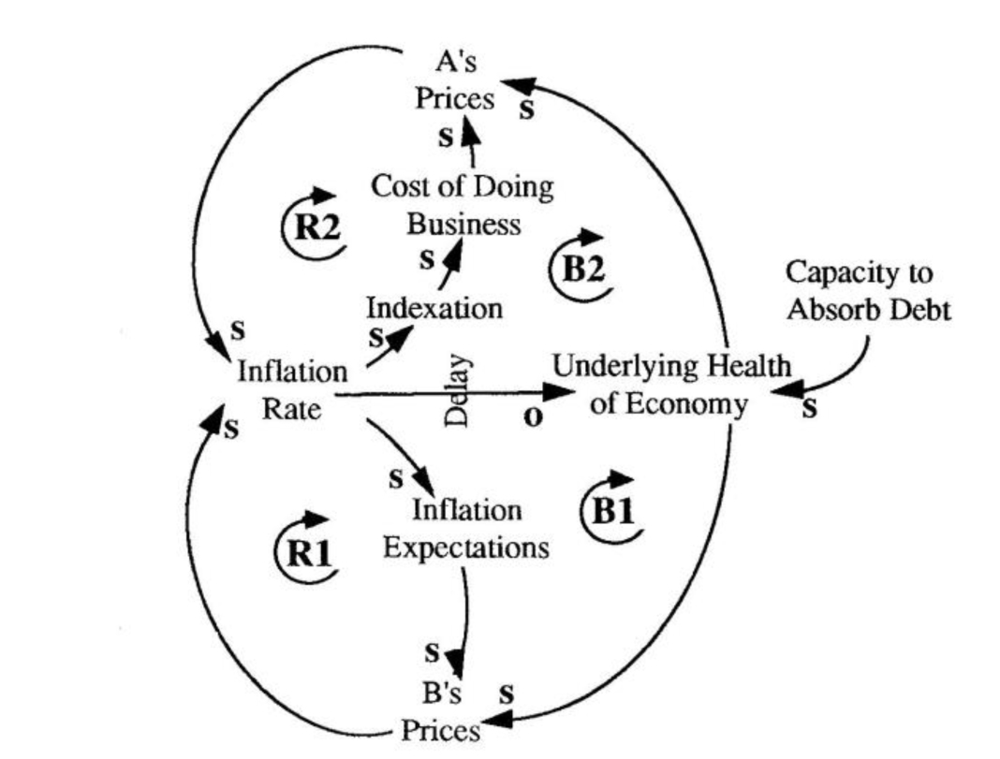

# Systems Thinking and Narrative Analysis 

## 1. System Archetype Identification

### Chosen Archetype: Tragedy of the Commons

### Generic Archetype to Specific Mapping

The generic **Tragedy of the Commons** archetype shows how many actors can damage a shared resource while pursuing their own short-term benefit. In the generic version, individual users increase their use of a common resource because that use creates immediate gain. As use rises, pressure on the shared resource rises as well. The damage is often delayed, so the system continues to reward extraction before the full cost becomes visible.

In this project, the shared resource is **global fish stocks**. The users are **countries, fleets, firms, and fishers** that depend on fisheries for income, employment, and seafood supply. The generic archetype maps onto the project in the following way:

#### Generic Archetype Elements
- **Users seeking private gain**
- **Resource extraction**
- **Short-term benefit**
- **Shared resource condition**
- **Long-term system health**
- **Restraint or regulation**

#### Specific Mapping to the Fisheries Case
- **Users seeking private gain** → Countries, fleets, and fishers seeking income, jobs, and stable harvests
- **Resource extraction** → Fishing Intensity
- **Short-term benefit** → Catch Volume and Fisher Income
- **Shared resource condition** → Fish Population
- **Long-term system health** → Ecosystem Health and long-run seafood sustainability
- **Restraint or regulation** → Regulation Strictness

This produces the same basic structure as the generic archetype.

### Reinforcing Loop: Private Gain Through Extraction

In the generic archetype, users increase resource use because it produces short-term benefit. In the fisheries case, this appears as:

- **Fishing Intensity** increases **Catch Volume**
- **Catch Volume** increases **Fisher Income**
- **Fisher Income** encourages greater **Fishing Intensity**

This is the project’s **R1 — Overfishing Cycle**. It explains why extraction can continue even when the resource is under stress. The loop rewards actors in the present, so it is hard to slow.

### Balancing Loop: Resource Decline and Correction

In the generic archetype, growing pressure on the shared resource weakens the system and eventually triggers balancing forces. In the fisheries case, this appears as:

- **Fishing Intensity** reduces **Fish Population**
- Lower **Fish Population** weakens **Ecosystem Health**
- Lower **Ecosystem Health** increases pressure for stronger **Regulation Strictness**
- Greater **Regulation Strictness** reduces **Fishing Intensity**

This is **B1 — Sustainability Control**. It is the balancing force in the system. It does not stop overuse immediately, but it pushes back once ecological decline becomes visible.

### Additional Project-Specific Adaptation Loop

The fisheries system also shows a response that is not part of the simplest generic archetype but is important in this project:

- Lower wild fish availability encourages more **Aquaculture Production**
- Greater **Aquaculture Production** increases **Seafood Supply**
- Greater **Seafood Supply** reduces pressure to expand **Fishing Intensity**

This is **B2 — Aquaculture Transition**. It does not remove the commons problem, but it shows how the system adapts when wild capture reaches limits.

### Why This Mapping Fits the Project

The visual evidence supports this mapping. Capture fisheries appear to have flattened, which suggests that the shared resource is under constraint. At the same time, aquaculture has grown sharply, indicating system adaptation. The sustainability map shows that management outcomes differ across countries, which is typical in a commons problem. The undernourishment map shows why the consequences matter beyond fisheries alone: in many places, fish supply is tied to food security as well as income.

For that reason, the generic **Tragedy of the Commons** archetype fits this project well. The same structure is present: private incentives encourage extraction, the shared resource deteriorates, and balancing forces respond only after pressure becomes visible. The decision-maker’s challenge is to intervene before short-term incentives cause long-term damage.

### Evidence That This Pattern Is Operating

The project’s visualizations provide evidence that this archetype is operating. The **Aquaculture vs. Capture** chart shows that capture fisheries have flattened while aquaculture has risen sharply. This suggests that wild fisheries are no longer supporting easy growth and that the system is already responding to ecological limits. The **Employment** visualization shows that traditional fishing remains a large source of work, which helps explain why pressure to maintain harvests remains strong even when sustainability concerns increase.

The **Sustainable Fisheries** map suggests that management outcomes differ across countries, which is consistent with a commons problem: some actors restrain use more effectively than others. The **Top Seafood Producers** visualization shows that production is concentrated in a relatively small number of countries, meaning that decisions by a few large producers can strongly affect the shared resource system. Finally, the **Global Undernourishment** map shows why this matters beyond ecology and income. In many vulnerable regions, fisheries are tied to food security as well as trade.

Together, these patterns support the Tragedy of the Commons interpretation. The system rewards extraction in the short run, delays correction, and places long-term pressure on the shared resource base. That is why the decision-maker’s choice matters so much. The issue is not only how much fish to catch now, but how to govern a shared system before short-term incentives cause lasting damage.

## 2. Scenario Narratives

### Scenario 1: Status Quo

If the decision-maker keeps current policy and maintains current harvesting levels, the system will likely appear stable at first. Fishing remains a major source of work and income. The **Employment** visualization shows that traditional fishers still make up a large labor force. For that reason, many governments and producers will prefer to avoid stricter regulation. In the short run, this choice protects current output and reduces political conflict.

Yet the deeper structure does not change. The reinforcing overfishing loop remains active: fishing intensity supports catch volume, catch volume supports income, and income supports continued fishing effort. At the same time, the balancing loop remains delayed. Fish populations absorb pressure until ecological decline becomes visible enough to force a response. By then, the system is weaker.

Over a five- to ten-year period, the most likely outcome is a slow loss of resilience. The **Capture Fisheries** trend already suggests that wild harvest has reached or is nearing a ceiling. A plausible projection is that capture production remains roughly flat, with little or no sustained growth, while costs rise as fleets work harder to preserve output. Aquaculture will probably continue to grow, but under this scenario it grows as a market response, not as part of a coordinated strategy.

The main uncertainty is pace. Some fisheries may remain productive longer than others. Some countries may absorb the pressure better because they already manage fisheries more sustainably. The main unintended consequence is complacency. Decision-makers may mistake flat output for a healthy system, even while ecological stress deepens underneath it. In regions already marked by undernourishment, that hidden decline may increase food vulnerability over time.

### Scenario 2: Intervention A — Stricter Catch Regulations

If the decision-maker chooses stricter catch regulations, the system changes at its pressure point. Fishing intensity falls because quotas, enforcement, or protected areas reduce extraction. This weakens the reinforcing overfishing loop. In the short term, that brings pain. Some fishers catch less. Some firms earn less. Some governments object. Because capture fisheries still employ many people, these costs will not be trivial.

Still, this scenario addresses the basic problem more directly than the status quo. The **Capture** trend suggests that wild fisheries are no longer expanding in a strong way. That means stricter regulation does not block endless future growth; rather, it protects a system already close to its limit. Over five to ten years, lower fishing pressure should improve stock conditions in at least part of the system. If fish populations stabilize or recover, ecosystem health improves, and the balancing sustainability loop becomes stronger and less reactive.

A plausible projection is that capture output declines modestly at first or remains below current levels, while aquaculture continues to rise and helps offset supply loss. Employment in capture may weaken in some places, but part of that loss could be absorbed if aquaculture growth continues. The outcome depends on policy design. If regulation is paired with support for transition, the system can adjust. If regulation is imposed without support, resistance will be stronger.

The key uncertainty is compliance. If enforcement is weak, stricter rules may push activity into illegal or unreported fishing. The main unintended consequence is uneven burden. Wealthier producers may adapt more easily than poorer ones, which could widen inequality across countries or sectors.

### Scenario 3: Intervention B — Managed Transition to a Mixed Seafood System

A more balanced option is a managed transition. Under this scenario, the decision-maker does not rely on strict restriction alone. Instead, it combines moderate tightening of capture fisheries with support for sustainable aquaculture, workforce adaptation, and long-term food security planning. This approach accepts what the visualizations suggest: wild capture appears constrained, while aquaculture is already expanding in both output and employment.

In the first few years, the transition is gradual. Capture fisheries remain important, but policy no longer treats them as the sole engine of future growth. Investment shifts toward responsible aquaculture and toward helping workers, producers, and governments adapt. This changes the system’s structure. Instead of trying to extract more from a strained commons, the decision-maker builds an alternative supply path.

Over five to ten years, this scenario offers the strongest chance of balancing ecology, employment, and food supply. A plausible projection is that capture remains stable or declines slightly, while aquaculture continues to grow and takes a larger share of total seafood production. Employment in aquaculture also rises, though it may not replace all capture jobs in the same places or at the same speed. The main benefit is resilience. The system becomes less dependent on pushing wild stocks beyond their limit.

The key uncertainty is governance quality. Aquaculture can help, but only if it grows under sound environmental standards. The main unintended consequence is substitution without reform. If aquaculture expands recklessly, the system may simply exchange one set of ecological problems for another. This path works only if the transition is managed, not assumed.

## 3. Leverage Point Analysis

The most promising leverage point in this system is the shift away from dependence on expanding wild capture and toward a managed mixed seafood system built on controlled capture and responsible aquaculture growth.

This point offers high impact because it changes the system where the evidence shows it is already moving. The visualizations suggest that capture fisheries have flattened while aquaculture has risen sharply. That means the system has already begun to adapt to limits in wild harvest. Good policy can guide that shift. Poor policy can ignore it.

This leverage point affects several feedback loops at once. First, it weakens the reinforcing overfishing loop. If seafood supply and income can come from sources other than expanding wild capture, the pressure to intensify fishing falls. Second, it strengthens the balancing sustainability loop by giving fish stocks more room to recover. Third, it creates an alternative production and employment pathway, which matters because the capture sector still supports many workers.

It offers high impact relative to effort because it builds on existing trends rather than trying to reverse them. The decision-maker does not need to invent a new sector. Aquaculture is already growing. The task is to shape that growth so it supports the broader system rather than distorting it.

The risks are real. Aquaculture can create pollution, habitat stress, feed pressure, or unequal access if poorly governed. Traditional fishers may resist a transition that threatens income, place, or identity. Major producing countries may also resist if they believe regulation or transition policy will reduce their advantage. There is also a political risk: a managed transition demands coordination, patience, and investment. Those are often harder to sustain than simple promises to preserve current harvest.

Even so, this is the best leverage point because it links the decision-maker’s immediate choice to the system’s long-run direction. It does more than slow harm. It begins to change the structure that produces harm.

## 4. Clear Connection to the Decision-Maker’s Choice

The decision-maker must choose between maintaining current harvesting levels and taking stronger action. The analysis points away from the status quo. Current harvesting levels may defend short-term economic stability, but they do not solve the system problem. The visual evidence suggests that capture fisheries are already near a limit. To preserve current pressure in a constrained system is not to preserve stability. It is to postpone adjustment.

Stricter catch regulation is stronger than inaction because it directly addresses overuse. Yet regulation alone may impose heavy costs on workers and regions that still depend on capture fisheries. For that reason, the best choice is not simple restriction by itself. The better choice is a managed transition: tighter control of wild capture, paired with support for responsible aquaculture and adaptation in the labor system.

That choice matches the evidence best. It responds to the plateau in capture fisheries. It uses the rise of aquaculture instead of ignoring it. It takes uneven sustainability performance seriously. It also respects the undernourishment map, which shows that food security remains fragile in many places. The decision-maker should therefore favor a path that protects wild stocks while building a more diversified and durable seafood system.
