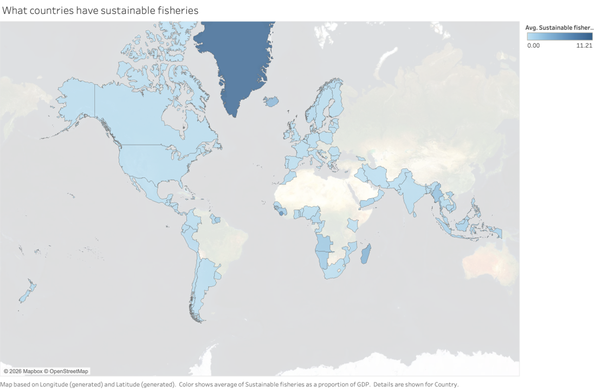
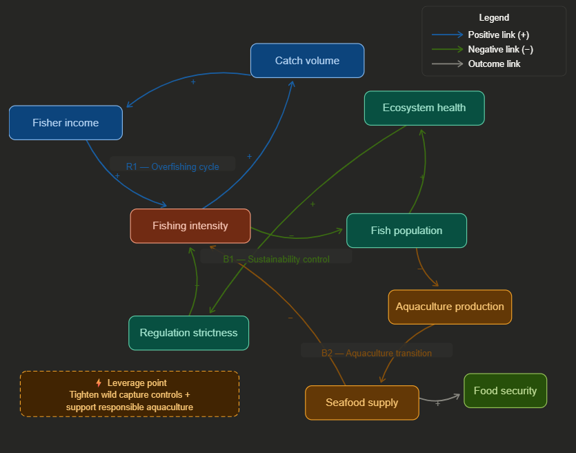

# Global Fisheries Sustainability Decision

## Decision Statement

Should an international fisheries management organization prioritize stricter catch regulations or maintain current harvesting levels to support economic stability?

---

## Executive Summary

Global fisheries sit at the center of a difficult policy problem. They provide food, jobs, trade, and income for millions of people, yet they also depend on ecosystems that can be degraded by overuse. The decision in this project asks whether a global fisheries regulation organization should preserve current harvesting levels for short-term economic stability or impose stronger controls to protect long-term sustainability.

My analysis suggests that maintaining current harvesting levels is the weaker long-term choice. The system contains a reinforcing overfishing cycle in which greater fishing effort increases catch and income, which then encourages still more fishing. At the same time, ecological decline triggers a balancing response through regulation, but that response often comes late. The evidence from my visualizations suggests that capture fisheries have flattened while aquaculture has expanded sharply, which indicates that wild harvest is already approaching important limits.

For that reason, I recommend a managed transition strategy. The decision-maker should tighten controls on wild capture fisheries while supporting responsible aquaculture growth and workforce adaptation. This approach protects fish stocks, supports long-term seafood supply, and offers a more resilient path than reliance on expanding harvest from stressed wild systems.

---

## Table of Contents

- [Project Title and Decision Statement](#global-fisheries-sustainability-decision)
- [Executive Summary](#executive-summary)
- [Background](#background)
- [Data Sources](#data-sources)
- [Exploratory Findings](#exploratory-findings)
- [System Dynamics](#system-dynamics)
- [Analysis](#analysis)
- [Recommendations](#recommendations)
- [Limitations and Future Work](#limitations-and-future-work)
- [References](#references)

---

## Background

Global fisheries are a shared resource system. They support livelihoods, national economies, and food supply, but they also face the risk of overuse. When fishing pressure rises faster than ecosystems can recover, fish populations decline, ecosystem health weakens, and long-term harvest potential falls.

This project examines that trade-off through a systems lens. It focuses on the decision faced by an international fisheries regulation organization: whether to maintain current harvesting levels for economic stability or impose stricter controls to improve long-term sustainability. The project combines exploratory visual analysis with systems thinking through a Causal Loop Diagram (CLD) and scenario-based decision analysis.

For a more detailed background discussion, see [`Background.md`](Background.md).

---

## Data Sources

This project uses multiple public data sources related to fisheries production, sustainability, employment, and food security.

- **Aquaculture and capture fisheries production data**  
  Used to compare long-term trends in seafood production and assess whether wild capture is still expanding.

- **Fisheries and aquaculture employment data**  
  Used to compare labor patterns across traditional fishing and aquaculture sectors.

- **Sustainable fisheries indicators**  
  Used to compare sustainability performance across countries.

- **Top seafood producer data**  
  Used to identify concentration in global seafood production.

- **Global undernourishment data**  
  Used to connect fisheries policy to broader food security concerns.

For dataset citations and source details, see the documentation in the `data/` folder and the project references section below.

---

## Exploratory Findings

### 1. Aquaculture vs. Capture Fisheries

This visualization shows a major structural shift in the seafood system. Capture fisheries appear to flatten over time, while aquaculture production rises sharply and eventually overtakes capture. This suggests that wild capture is no longer a reliable source of continued growth and that aquaculture has become the main expansion path in seafood supply.

### 2. Employment in Fisheries and Aquaculture

This chart shows that traditional fishing remains a major source of work, even as aquaculture employment grows. That matters for policy. Abrupt restrictions on capture fishing could impose real costs on workers and communities that still depend heavily on the sector.

### 3. Sustainable Fisheries by Country

This map suggests that fisheries sustainability is uneven across countries. Some countries appear to manage fisheries more effectively than others, which means governance quality is an important part of the decision context.

### 4. Top Seafood Producers

This visualization shows that seafood production is concentrated in a relatively small number of countries. That concentration matters because decisions by a few major producers can shape the wider global system.

### 5. Global Undernourishment

This map shows that food insecurity remains concentrated in vulnerable regions, especially in parts of Sub-Saharan Africa and selected countries in Asia and Oceania. This adds an important human dimension to the fisheries decision. Fish are not only an economic product. In many regions, they are also part of food security.

---

## System Dynamics

## Final Causal Loop Diagram

The final Causal Loop Diagram shows a system pulled by appetite and restraint. At its center lies **R1, the overfishing cycle**. As **Fishing Intensity** rises, **Catch Volume** rises with it. Higher catch raises **Fisher Income**, and higher income encourages still more fishing. This is a reinforcing loop. It feeds on its own success. In the short run, it rewards effort. In the long run, it drives pressure onto the resource that supports it.

Set against it is **B1, the sustainability control loop**. Greater **Fishing Intensity** reduces **Fish Population**. Lower fish populations weaken **Ecosystem Health**. As ecosystem health declines, pressure for stronger **Regulation Strictness** grows. Stricter regulation then pushes fishing intensity down. This balancing loop explains why the system does not expand without limit. It also explains why regulation often feels reactive. The corrective force enters only after ecological damage becomes visible.

The diagram adds a third loop, **B2, the aquaculture transition loop**. As wild fish populations come under strain, the system shifts toward **Aquaculture Production**. Higher aquaculture output increases **Seafood Supply**, and greater seafood supply reduces pressure to keep expanding capture fishing. This loop matters because the project’s visual evidence suggests that capture fisheries have flattened while aquaculture has grown sharply. The system is already adapting to limits, though not always by design.

Together, these loops explain the behavior seen in the project. Economic incentives push the system toward higher harvest. Ecological decline pushes back. Aquaculture emerges as a substitute path when wild capture can no longer bear the same load. The structure produces a familiar result: short-term stability can hide long-term fragility.

The most important intervention lies where these loops meet. The leverage point is not regulation alone, nor aquaculture alone, but the combination of **tighter control of wild capture fisheries and support for responsible aquaculture growth**. That shift weakens the reinforcing overfishing loop while strengthening the two balancing loops. For the decision-maker, the choice is clear in principle, though hard in practice. To maintain current harvesting levels is to preserve present income at the risk of future decline. To guide the system toward a mixed and more sustainable seafood model is to trade some ease now for greater resilience later.

---

## Analysis

### System Archetypes

The clearest archetype in this project is the **Tragedy of the Commons**. Global fish stocks are a shared resource. Individual actors have reason to increase catch for private benefit, but when many actors do so at once, the shared resource declines. This pattern appears in the project’s overfishing loop, where rising fishing intensity increases catch and income, which then encourages more fishing.

A second useful archetype is **Limits to Growth**. Capture fisheries appear to have reached a plateau, while aquaculture continues to rise. That pattern suggests that one part of the system has met ecological limits, while another part expands to compensate.

### Scenario Narratives

The Milestone 3 analysis considered three system paths over the next five to ten years:

- **Status Quo**: Current harvesting levels remain in place. This may preserve short-term stability but risks deeper ecological stress and delayed correction.
- **Intervention A — Stricter Catch Regulation**: Stronger controls reduce fishing intensity and improve long-term stock resilience, but may impose short-term costs on workers and producers.
- **Intervention B — Managed Transition**: Moderate tightening of capture fisheries is paired with support for responsible aquaculture and workforce adaptation. This offers the best balance among sustainability, employment, and seafood supply.

### Leverage Point Analysis

The most important leverage point is the shift away from dependence on expanding wild capture and toward a more sustainable mixed seafood system. This matters because it affects several feedback loops at once. It reduces pressure on wild fish stocks, supports long-term supply, and creates an alternative path for production and employment.

For the full Analysis, see [`Analysis.md`](Analysis.md).

---

## Recommendations

I recommend that the Global Fisheries Management Organization adopt a **managed transition strategy**: tighten controls on wild capture fisheries while supporting the growth of responsible aquaculture. This is the soundest course. It protects fish stocks, preserves long-term seafood supply, and gives the system a practical path away from dependence on ever-higher wild harvests. To maintain current harvesting levels may seem prudent in the short run, but it would leave the main problem untouched.

The evidence points in one direction. The project’s visualizations suggest that **capture fisheries have flattened**, while **aquaculture production has risen sharply**. That pattern matters. It implies that wild capture is approaching, or has already reached, a limit in many parts of the system. At the same time, aquaculture is taking on a larger role in total seafood production. The employment data also show that traditional fishing remains a major source of work. This means the organization cannot rely on abrupt restriction alone. A strong policy must protect the resource without disregarding the people who depend on it. The sustainability map adds a further point: countries do not manage fisheries equally well. Some systems are better governed than others. The undernourishment map makes the stakes clearer still. In food-insecure regions, strain on seafood supply is not merely an economic issue. It is a human one.

This recommendation rests on present evidence, not certainty. It could change under several conditions. If new data showed broad and durable recovery in major wild fish stocks, the urgency of tighter controls might lessen. If aquaculture expansion proved more environmentally harmful than expected, then support for it would need stricter limits and stronger standards. The recommendation also depends on enforcement. Rules that cannot be monitored or enforced will not change outcomes.

The next steps should be practical. First, the organization should identify the most stressed fisheries and apply tighter catch controls there as a priority. Second, it should support responsible aquaculture through clear standards, incentives, and monitoring, so growth in that sector does not create a new environmental problem. Third, it should encourage transition support for affected workers and fishing communities, including training and investment where possible. Fourth, it should improve international coordination, since a shared resource cannot be managed well through isolated action alone.

The analysis would be stronger with more stock-level biological data, clearer regional employment figures, and better evidence on the environmental effects of aquaculture expansion. Even so, the present case is strong enough to support action. The organization should guide the system toward a more durable balance: lower pressure on wild fisheries, stronger oversight, and a more resilient seafood supply.

---

## Limitations and Future Work

This project has several limits.

First, it relies on aggregated visual evidence rather than stock-by-stock biological modeling. That makes it useful for strategic decision support, but less precise for fishery-specific regulation. Second, the project uses cross-national indicators that may vary in quality, definitions, and coverage. Third, the relationship between aquaculture growth and ecological sustainability is complex. Aquaculture can reduce pressure on wild stocks, but poorly managed expansion can create environmental problems of its own.

Future work could improve the project in several ways. A stronger next step would be to incorporate stock-level biological data, regional employment data, and clearer time-series forecasting for capture versus aquaculture output. It would also help to compare policy scenarios across specific regions rather than only at the global level. A dashboard or interactive decision-support tool could make the analysis more useful to policymakers.

---

## References

> Replace or expand these with your final APA references based on the sources in your `data/` folder and dataset README files.

- Food and Agriculture Organization of the United Nations. Fisheries and aquaculture datasets.
- Our World in Data. Undernourishment and food security datasets.
- Sustainable fisheries indicator sources used in project visualizations.
- Additional project datasets listed in the `data/` directory.

---

