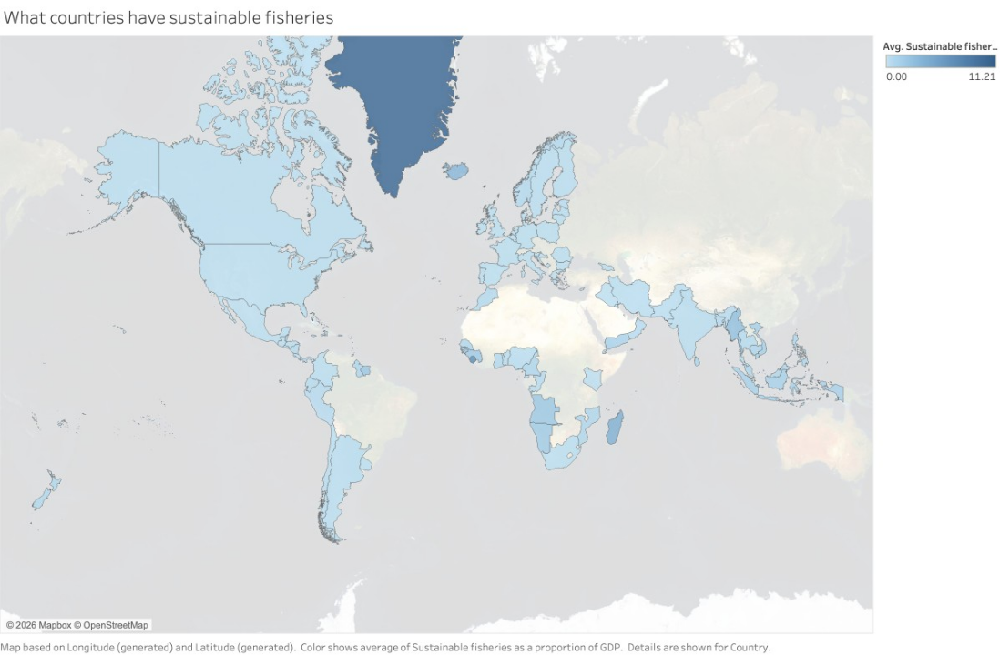

---
# Visualization 3 — Fisheries Trade / Economic Value
This visualization illustrates the economic value of fisheries through international trade, showing how seafood exports contribute significantly to national economies. The data highlights that many countries rely heavily on fisheries as a source of income, with strong trade values indicating deep integration into global markets. This reveals that fisheries are not only an environmental and food issue, but also a key economic driver.

This matters for the decision because it introduces a clear economic tradeoff: reducing fishing activity to protect ecosystems could lead to short-term declines in export revenue. For countries that depend on fisheries trade, this creates resistance to stricter sustainability policies. Decision-makers must therefore consider strategies that maintain economic stability, such as transitioning to higher-value sustainable products or diversifying income sources, while still protecting fish stocks for long-term viability.
