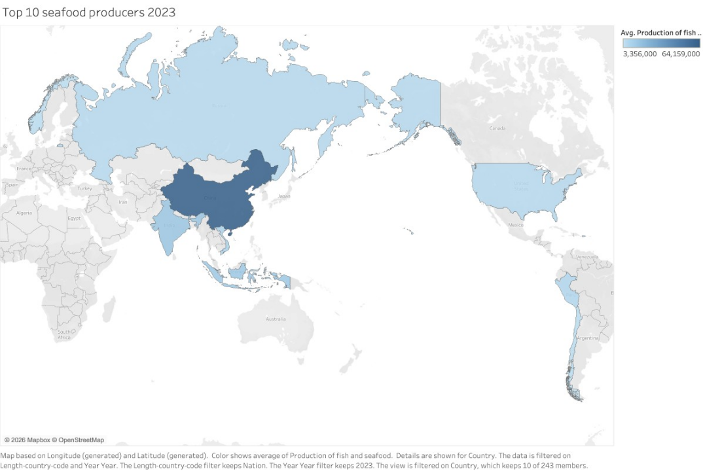

---

This visualization highlights the relationship between food insecurity and reliance on fish as a primary protein source. It shows that in many regions, particularly in developing countries, fish plays a critical role in daily nutrition. Areas with higher levels of food insecurity often depend more heavily on fisheries, making access to fish essential for maintaining food security.

This matters for the decision because it demonstrates that fisheries are directly linked to human well-being, not just economic or environmental outcomes. Policies that limit fishing without providing alternatives could worsen food insecurity in vulnerable populations. For decision-makers, this emphasizes the need for a balanced approach that protects fish stocks while ensuring continued access to affordable nutrition, potentially through sustainable aquaculture or targeted food support programs.
