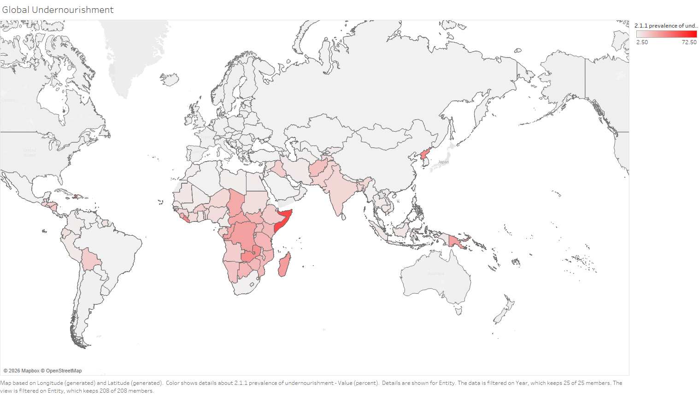

---

# Visualization — Global Undernourishment (World Map)
This visualization shows the global distribution of undernourishment, measured as the percentage of the population experiencing insufficient food intake. Countries shaded in darker red indicate higher levels of undernourishment, while lighter shades represent lower prevalence. The map reveals that undernourishment is concentrated in specific regions, particularly across Sub-Saharan Africa and parts of South Asia, while much of Europe and North America show relatively low levels. This uneven distribution highlights significant global disparities in access to adequate nutrition.

This matters for the decision because it directly connects fisheries to global food security. In regions with high undernourishment, access to affordable protein sources like fish is critical for meeting basic nutritional needs. Any policies that restrict fishing activity without providing alternatives could exacerbate food insecurity in these vulnerable areas. For decision-makers, this emphasizes the need to balance sustainability efforts with the necessity of maintaining food access, ensuring that conservation strategies do not unintentionally worsen undernourishment in already at-risk populations.
